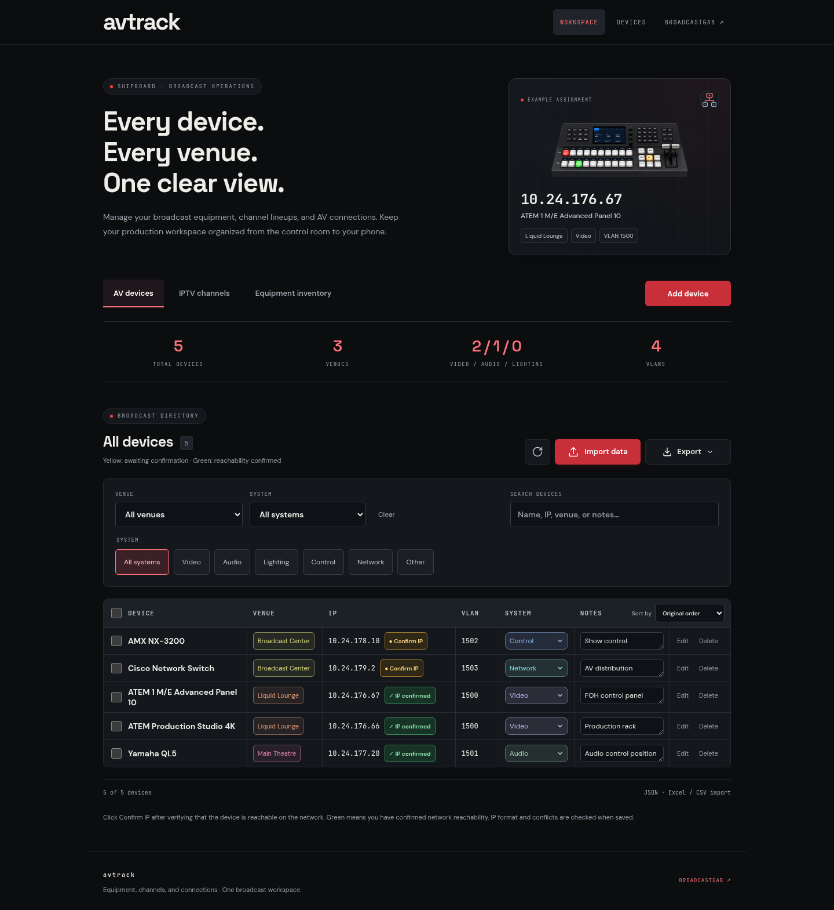

# avtrack previews

Sample data is used in these screenshots. Headings use Space Grotesk and body text uses DM Sans, matching broadcastgab.com.

[Download every screenshot](broadcasthub-all-screenshots.zip)

| Section | Desktop | Mobile | PDF | Export menu |
| --- | --- | --- | --- | --- |
| AV devices | [View](broadcasthub-av-devices-desktop.png) | [View](broadcasthub-av-devices-mobile.png) | [View](broadcasthub-av-devices-pdf.png) | [View](broadcasthub-av-devices-export-menu.png) |
| IPTV channels | [View](broadcasthub-iptv-channels-desktop.png) | [View](broadcasthub-iptv-channels-mobile.png) | [View](broadcasthub-iptv-channels-pdf.png) | [View](broadcasthub-iptv-channels-export-menu.png) |
| Equipment inventory | [View](broadcasthub-equipment-desktop.png) | [View](broadcasthub-equipment-mobile.png) | [View](broadcasthub-equipment-pdf.png) | [View](broadcasthub-equipment-export-menu.png) |

Other branding details:

- [Header](broadcasthub-header.png)
- [Footer](broadcasthub-footer.png)
- [Mobile navigation](broadcasthub-mobile-menu.png)
- [App icon](broadcasthub-favicon.png)
- [Download filenames](broadcasthub-download-filenames.png)
- [Import message](broadcasthub-import-message.png)

## Desktop preview

## PDF preview

